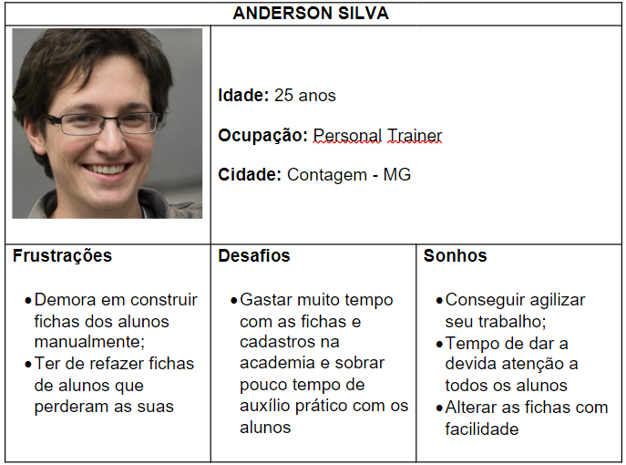
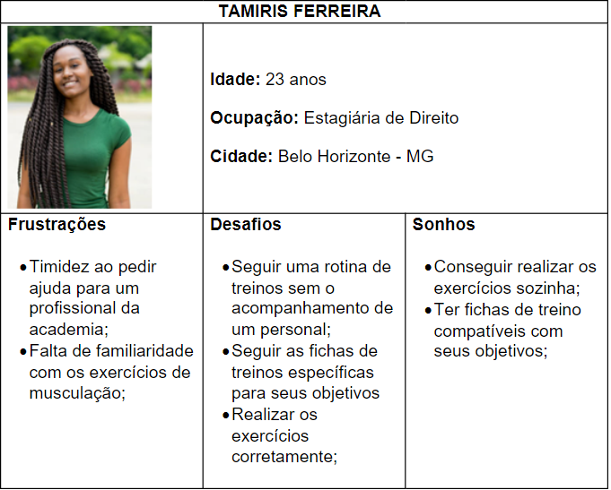
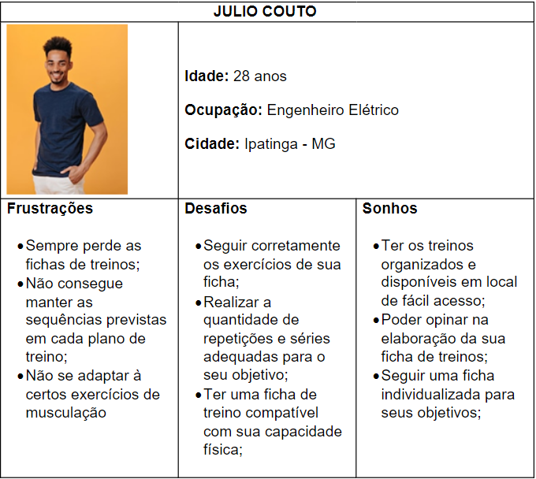
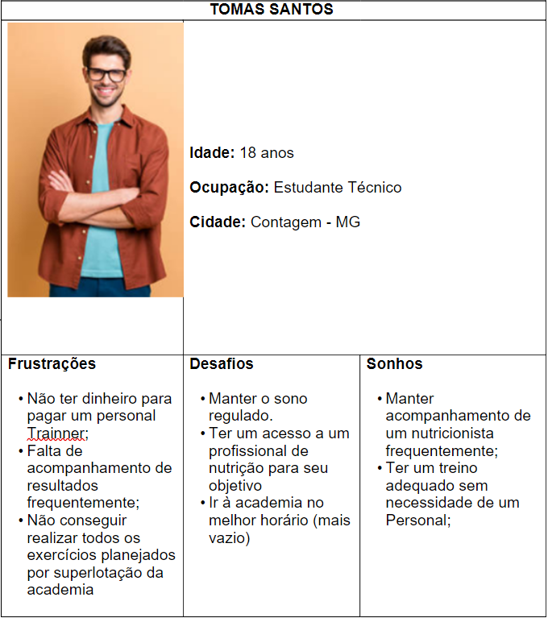

# Especificações do Projeto

Pré-requisitos: <a href="1-Documentação de Contexto.md"> Documentação de Contexto</a>

A definição exata do problema e os pontos mais relevantes a serem tratados neste projeto foi consolidada com a participação dos usuários em um trabalho de imersão feita pelos membros da equipe a partir da observação dos usuários em seu local natural e por meio de entrevistas. Os detalhes levantados nesse processo foram consolidados na forma de personas e histórias de usuários. 

## Personas

 
  

  ##### _Figura 1- Persona: ANDERSON SILVA_

 
  

  ##### _Figura 2- Persona: TAMIRIS FERREIRA_

 
  

  ##### _Figura 3- Persona: JULIO COUTO_

 
  

  ##### _Figura 4- Persona: TOMAS SANTOS_

## Histórias de Usuários

A partir da compreensão do dia a dia das pessoas identificadas para o projeto, foram registradas as seguintes histórias de usuários. 

|EU COMO... `PERSONA`| QUERO/PRECISO ... `FUNCIONALIDADE` |PARA ... `MOTIVO/VALOR`                 |
|--------------------|------------------------------------|----------------------------------------|
| Tamiris Ferreira   | Ter acesso a uma rotina de treinos personalizada (RF-03)            | Alcançar meus objetivos pessoais                |
| Julio Couto        | Ter uma ficha de treino compatível com meu tipo físico (RF-03)                  | Realizar exercícios da forma correta  |
| Tomas Santos    | Ter acesso a listagem de profissionais da academia (RF-13)             | Acompanhar minha alimentação, planejamentos e personalização de treinos com profissional                |
| Tamiris Ferreira        | Ter um roteiro correto de exercícios (RF-15; 06)                  | Realizar de forma autônoma   |
| Tomas Santos    | Ter acesso rápido às suas fichas de treino (RF-03)              | Não haver necessidade de utilizar fichas físicas                |
| Julio Couto         | Avaliar os exercícios (RF-11)                   | Ter recomendações de exercícios de acordo com meus gostos pessoais    |
| Julio Couto         | Cadastrar meu perfil (RF-01)                    | Salvar e editar minhas informações pessoais  |
| Tomas Santos    | Ter acesso à informações comerciais da academia (RF-14)               | Estar atualizado dos valores da academia que frequento                 |
| Tomas Santos    | Ter acesso ao histórico dos meus treinos e informações físicas (RF-16)              | Acompanhar minha evolução e resultados  físicas                |
| Anderson Silva     | Ter facilidade em captar clientes (RF-02; 13)               | Melhorar a carreira profissional                |
| Anderson Silva     | Otimizar a construção das fichas (RF-07)             | Agilizar o trabalho                |
| Anderson Silva     | Sistema de exercícios mais automatizado (RF-05; 06; 15)               | Dar mais atenção aos alunos                  |

## Requisitos

O escopo funcional do projeto é definido por meio dos requisitos funcionais que descrevem as possibilidades de interação dos usuários, bem como os requisitos não funcionais que descrevem os aspectos que o sistema deverá apresentar de maneira geral. Estes requisitos são apresentados a seguir. 

### Requisitos Funcionais

A tabela a seguir apresenta os requisitos do projeto, identificando a prioridade em que os mesmos devem ser entregues. 

|ID    | Descrição do Requisito  | Prioridade |
|------|-----------------------------------------|----|
|RF-01| O site deve permitir que o usuário realize o cadastro no sistema e acesse seu perfil | ALTA | 
|RF-02| O sistema irá permitir o usuário a agendar avaliações com profissionais da academia | BAIXA |
|RF-03| O site permitirá o acesso à ficha personalizada do usuário | ALTA |
|RF-04| O sistema irá mostrar um ranqueamento das pontuações dos usuários | BAIXA |
|RF-05| O sistema irá distribuir pontuações de acordo com a finalização de cada exercício | BAIXA |
|RF-06| O sistema emitirá alertas e dicas sobre exercícios | ALTA |
|RF-07| O sistema permitirá ao perfil de profissional o cadastro de uma ficha personalizada para cada aluno | ALTA |
|RF-08| O sistema deve permitir o cadastro de perfis administradores de profissionais da academia | ALTA |
|RF-09| O sistema exibirá informações de quantidade de pessoas presentes na academia | BAIXA |
|RF-10| O sistema permitirá a funcionalidade de check-in e checkout  | BAIXA |
|RF-11| O sistema irá permitir a avaliação de cada exercício  | MÉDIA |
|RF-12| O sistema dará uma opção de cronometrar os exercícios realizados | BAIXA |
|RF-13| O sistema exibirá uma listagem de profissionais disponíveis na academia para os usuários | MÉDIA |
|RF-14| O site irá fornecer ao cliente acesso as promoções da academia  | BAIXA |
|RF-15| O site irá exibir para cada exercício informações de tempo, carga sugerida e dicas de execução | ALTA |
|RF-16| O sistema exibirá no perfil do usuário o histórico de exercícios e informações cadastrais | BAIXA |
|RF-17| O sistema deve exibir informações de contato da academia | BAIXA |
|RF-18| O sistema deve permitir ao instrutor cadastrar exercícios físicos na base de dados do sistema | ALTA |

### Requisitos não Funcionais

|ID     | Descrição do Requisito  |Prioridade |
|-------|-------------------------|----|
|RNF-001| O site deve ser publicado em um ambiente acessível publicamente na Internet (GitHub Pages) | ALTA | 
|RNF-002| O site deverá ser responsivo permitindo a visualização em um celular de forma adequada |  ALTA | 
|RNF-003| O site deve ter bom nível de contraste entre os elementos da tela |  ALTA | 
|RNF-004| O site deve ser compatível com os princiapais navegadores do marcado (Google Chrome, Microsfot Edge) |  ALTA | 
|RNF-005| O site deve apresentar alta usabilidade ao usuário |  ALTA | 
|RNF-006| O site deverá estar disponível 24 horas por dia, todos os dias da semana |  BAIXA | 

## Restrições

O projeto está restrito pelos itens apresentados na tabela a seguir.

|ID| Restrição                                             |
|--|-------------------------------------------------------|
|01| O projeto deverá ser entregue até o final do semestre |

## Diagrama de Casos de Uso

 O diagrama de caso de uso abaixo demonstra as interações do Cliente, do Instrutor e do Administrador do Sistema, com o sistema para academias StayFit.

 
  

  ##### _Figura 5- Diagrama de Caso de Uso_
  

