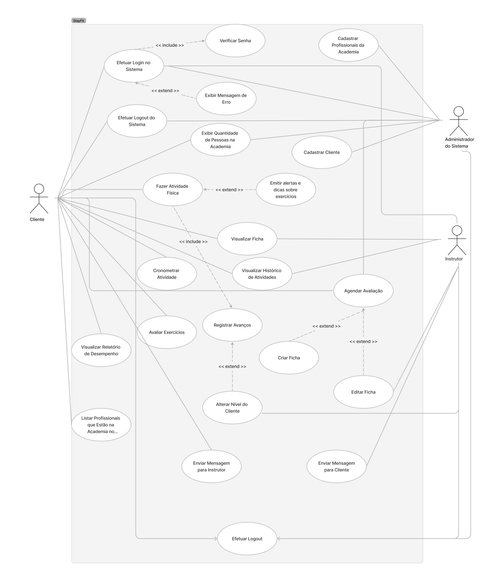

# Especificações do Projeto

Pré-requisitos: <a href="1-Documentação de Contexto.md"> Documentação de Contexto</a>

Definição do problema e ideia de solução a partir da perspectiva do usuário. É composta pela definição do  diagrama de personas, histórias de usuários, requisitos funcionais e não funcionais além das restrições do projeto.

Apresente uma visão geral do que será abordado nesta parte do documento, enumerando as técnicas e/ou ferramentas utilizadas para realizar a especificações do projeto

## Personas

Pedro Paulo tem 26 anos, é arquiteto recém-formado e autônomo. Pensa em se desenvolver profissionalmente através de um mestrado fora do país, pois adora viajar, é solteiro e sempre quis fazer um intercâmbio. Está buscando uma agência que o ajude a encontrar universidades na Europa que aceitem alunos estrangeiros.

Enumere e detalhe as personas da sua solução. Para tanto, baseie-se tanto nos documentos disponibilizados na disciplina e/ou nos seguintes links:

> **Links Úteis**:
> - [Rock Content](https://rockcontent.com/blog/personas/)
> - [Hotmart](https://blog.hotmart.com/pt-br/como-criar-persona-negocio/)
> - [O que é persona?](https://resultadosdigitais.com.br/blog/persona-o-que-e/)
> - [Persona x Público-alvo](https://flammo.com.br/blog/persona-e-publico-alvo-qual-a-diferenca/)
> - [Mapa de Empatia](https://resultadosdigitais.com.br/blog/mapa-da-empatia/)
> - [Mapa de Stalkeholders](https://www.racecomunicacao.com.br/blog/como-fazer-o-mapeamento-de-stakeholders/)
>
Lembre-se que você deve ser enumerar e descrever precisamente e personalizada todos os clientes ideais que sua solução almeja.

## Histórias de Usuários

Com base na análise das personas forma identificadas as seguintes histórias de usuários:

|EU COMO... `PERSONA`| QUERO/PRECISO ... `FUNCIONALIDADE` |PARA ... `MOTIVO/VALOR`                 |
|--------------------|------------------------------------|----------------------------------------|
|Usuário do sistema  | Registrar minhas tarefas           | Não esquecer de fazê-las               |
|Administrador       | Alterar permissões                 | Permitir que possam administrar contas |

Apresente aqui as histórias de usuário que são relevantes para o projeto de sua solução. As Histórias de Usuário consistem em uma ferramenta poderosa para a compreensão e elicitação dos requisitos funcionais e não funcionais da sua aplicação. Se possível, agrupe as histórias de usuário por contexto, para facilitar consultas recorrentes à essa parte do documento.

> **Links Úteis**:
> - [Histórias de usuários com exemplos e template](https://www.atlassian.com/br/agile/project-management/user-stories)
> - [Como escrever boas histórias de usuário (User Stories)](https://medium.com/vertice/como-escrever-boas-users-stories-hist%C3%B3rias-de-usu%C3%A1rios-b29c75043fac)
> - [User Stories: requisitos que humanos entendem](https://www.luiztools.com.br/post/user-stories-descricao-de-requisitos-que-humanos-entendem/)
> - [Histórias de Usuários: mais exemplos](https://www.reqview.com/doc/user-stories-example.html)
> - [9 Common User Story Mistakes](https://airfocus.com/blog/user-story-mistakes/)

## Requisitos

O escopo funcional do projeto é definido por meio dos requisitos funcionais que descrevem as possibilidades de interação dos usuários, bem como os requisitos não funcionais que descrevem os aspectos que o sistema deverá apresentar de maneira geral. Estes requisitos são apresentados a seguir. 

### Requisitos Funcionais

A tabela a seguir apresenta os requisitos do projeto, identificando a prioridade em que os mesmos devem ser entregues. 

|ID    | Descrição do Requisito  | Prioridade |
|------|-----------------------------------------|----|
|RF-01| O site deve permitir que o usuário realize o cadastro no sistema e acesse seu perfil | ALTA | 
|RF-02| O sistema irá permitir o usuário a agendar avaliações com profissionais da academia | BAIXA |
|RF-03| O site permitirá o acesso à ficha personalizada do usuário | ALTA |
|RF-04| O sistema irá mostrar um ranqueamento das pontuações dos usuários | BAIXA |
|RF-05| O sistema irá distribuir pontuações de acordo com a finalização de cada exercício | BAIXA |
|RF-06| O sistema emitirá alertas e dicas sobre exercícios | ALTA |
|RF-07| O sistema permitirá ao perfil de profissional o cadastro de uma ficha personalizada para cada aluno | ALTA |
|RF-08| O sistema deve permitir o cadastro de perfis administradores de profissionais da academia | ALTA |
|RF-09| O sistema exibirá informações de quantidade de pessoas presentes na academia | BAIXA |
|RF-10| O sistema permitirá a funcionalidade de check-in e checkout  | BAIXA |
|RF-11| O sistema irá permitir a avaliação de cada exercício  | MÉDIA |
|RF-12| O sistema dará uma opção de cronometrar os exercícios realizados | BAIXA |
|RF-13| O sistema exibirá uma listagem de profissionais disponíveis na academia para os usuários | MÉDIA |
|RF-14| O site irá fornecer ao cliente acesso as promoções da academia  | BAIXA |
|RF-15| O site irá exibir para cada exercício informações de tempo, carga sugerida e dicas de execução | ALTA |
|RF-16| O sistema exibirá no perfil do usuário o histórico de exercícios e informações cadastrais | BAIXA |
|RF-17| O sistema deve exibir informações de contato da academia | BAIXA |

### Requisitos não Funcionais

|ID     | Descrição do Requisito  |Prioridade |
|-------|-------------------------|----|
|RNF-001| O site deve ser publicado em um ambiente acessível publicamente na Internet (GitHub Pages) | ALTA | 
|RNF-002| O site deverá ser responsivo permitindo a visualização em um celular de forma adequada |  ALTA | 
|RNF-003| O site deve ter bom nível de contraste entre os elementos da tela |  ALTA | 
|RNF-004| O site deve ser compatível com os princiapais navegadores do marcado (Google Chrome, Microsfot Edge) |  ALTA | 
|RNF-005| O site deve apresentar alta usabilidade ao usuário |  ALTA | 
|RNF-006| O site deverá estar disponível 24 horas por dia, todos os dias da semana |  BAIXA | 

## Restrições

O projeto está restrito pelos itens apresentados na tabela a seguir.

|ID| Restrição                                             |
|--|-------------------------------------------------------|
|01| O projeto deverá ser entregue até o final do semestre |

## Diagrama de Casos de Uso

 O diagrama de caso de uso abaixo demonstra as interações do Cliente, do Instrutor e do Administrador do Sistema, com o sistema para academias StayFit.

 
  

##### _Figura 1- Diagrama de Caso de Uso_