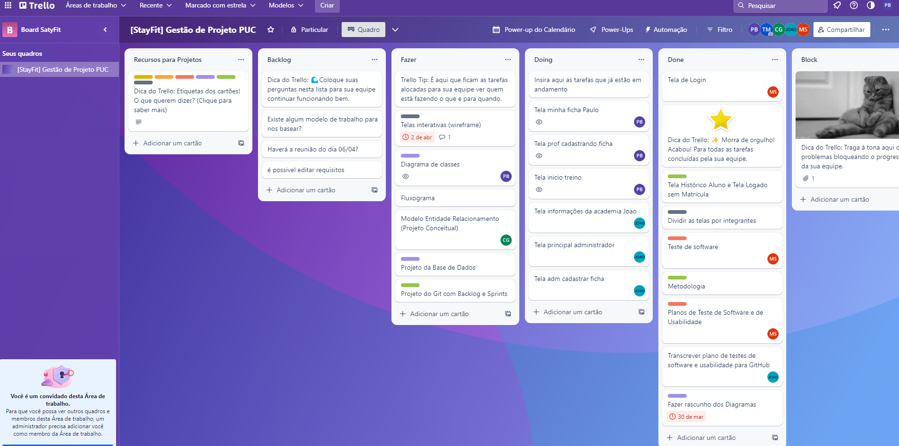
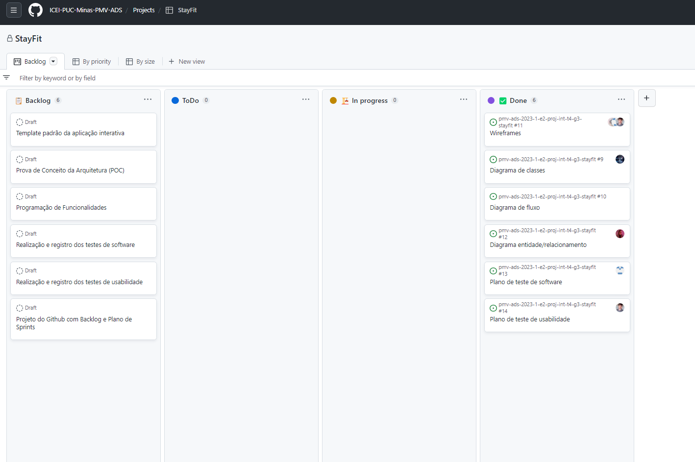

# 3 Metodologia

Pré-requisitos: <a href="2-Especificação do Projeto.md"> Documentação de Especificação</a>

A metodologia contempla as definições de ferramentas utilizadas pela equipe tanto para a manutenção dos códigos e demais artefatos quanto para a organização do time na execução das tarefas do projeto.

## 3.1. Ambientes de trabalho

Os artefatos do projeto são desenvolvidos a partir de diversas plataformas e a relação dos ambientes com seu respectivo propósito é apresentada na tabela que se segue. 

| AMBIENTE                          | PLATAFORMA        | LINK DE ACESSO |
| ----------------------------------|-------------------|----------------|
| Repositório de código fonte       | GitHub            | [Git.Icei](https://github.com/ICEI-PUC-Minas-PMV-ADS/pmv-ads-2023-1-e2-proj-int-t4-g3-stayfit)
| Documentação de contexto          | GitHub            | [Doc.Contexto](https://github.com/ICEI-PUC-Minas-PMV-ADS/pmv-ads-2023-1-e2-proj-int-t4-g3-stayfit/blob/main/docs/01-Documenta%C3%A7%C3%A3o%20de%20Contexto.md)
| Especificações do Projeto         | GitHub            | [Esp.Projeto](https://github.com/ICEI-PUC-Minas-PMV-ADS/pmv-ads-2023-1-e2-proj-int-t4-g3-stayfit/blob/main/docs/02-Especifica%C3%A7%C3%A3o%20do%20Projeto.md)
| Projeto de Interface e Wireframes | Figma             | https://www.figma.com/file/bVtZWbFrOazzYkKon3pfYU/User-Flow?node-id=0%3A1)-[Wireframes-Iterativo]https://www.figma.com/file/FFJu2SzwhhymVbhERLefjc/App-Fitness-(Copy)?t=ivTvGBM4HDShS4Dw-0
|Documentos do projeto          | Microsoft Word | https://github.com/orgs/ICEI-PUC-Minas-PMV-ADS/projects/133/views/1](https://sgapucminasbr-my.sharepoint.com/:w:/g/personal/1413347_sga_pucminas_br/Ecs8JEgjMtBJhA-4GRgn6z0BxWrSXwVDlUnUvjpLkStllQ?e=Q52zeY)

## 3.2. Gerenciamento do Projeto

### A equipe utiliza metodologias ágeis, tendo escolhido o Scrum como base para definição do processo de desenvolvimento. 

  

A equipe está organizada da seguinte maneira: 

- Scrum Master: Camila Larissa 
- Product Owner: Thaís Menezes 

 Equipe de Desenvolvimento 

- João Marcos 
- Marcos 
- Paulo 

  

### Para organização e distribuição das tarefas do projeto, a equipe está utilizando o Trello estruturado com as seguintes listas: 

  

- Backlog: Recebe as tarefas a serem trabalhadas e representa o Product Backlog. Todas as atividades identificadas no decorrer do projeto também devem ser incorporadas a esta lista. 

- To Do: Esta lista representa o Sprint Backlog. Este é o Sprint atual que estamos trabalhando. 

- Doing: Quando uma tarefa tiver sido iniciada, ela é movida para cá. 

-	Done: nesta lista são colocadas as tarefas que passaram pelos testes e controle de qualidade e estão prontos para serem entregues ao usuário. Não há mais edições ou revisões necessárias, ele está agendado e pronto para a ação. 

- Block: Nesta lista são colocadas as tarefas que estão passando por algum tipo de impedimento, dependendo de aprovação ou andamento de outra task, ou seja, tarefas que estão bloqueadas de prosseguir. Dessa maneira o grupo consegue visualizar e auxiliar caso seja necessário 

  

O quadro kanban do grupo desenvolvido na ferramenta de gerenciamento de projetos está disponível através da Trello e é apresentado, no estado atual, na Figura 1. 

 
  

 
##### _Figura 1_

 

Também utilizamos a ferramenta do GitHub para gerenciar nosso Product Backlog

 
  

 
##### _Figura 2 Backlog Git_

 
