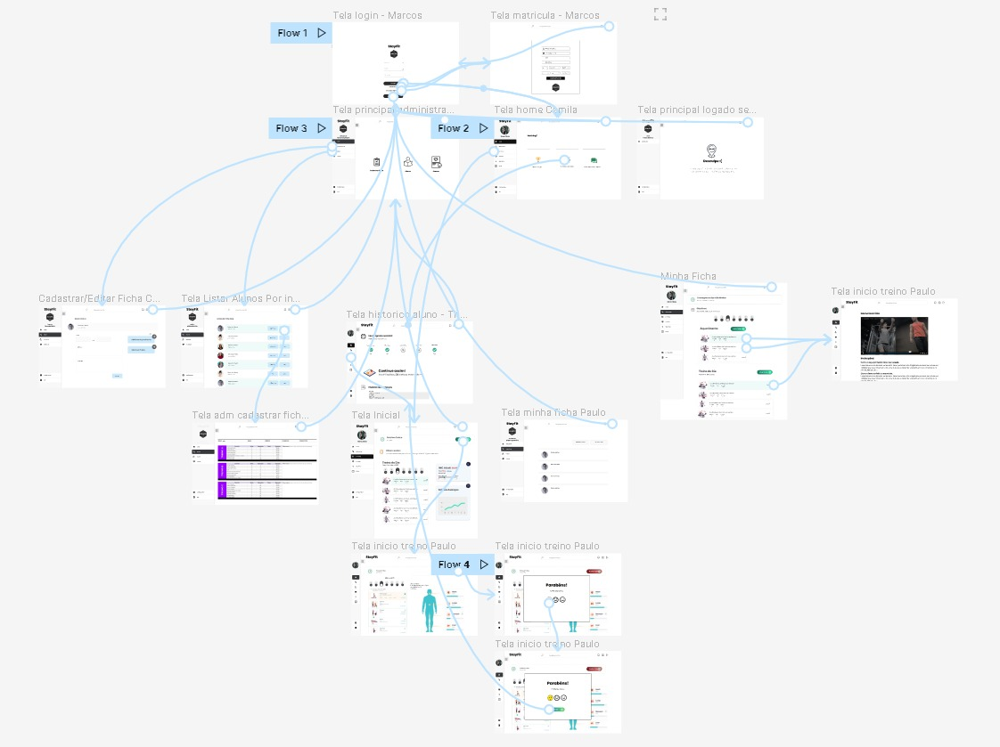
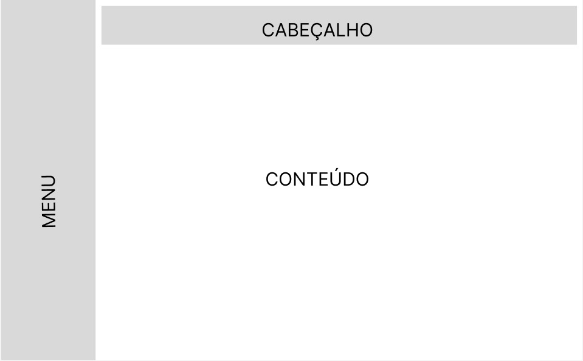
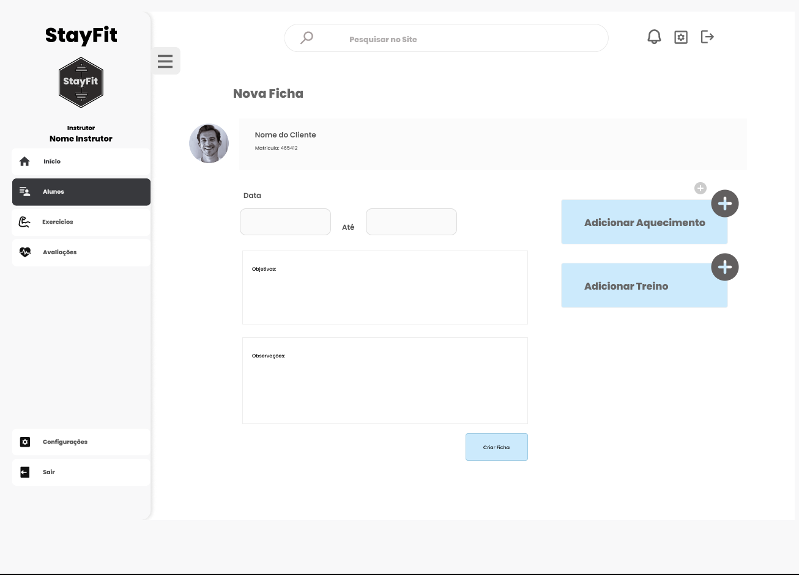
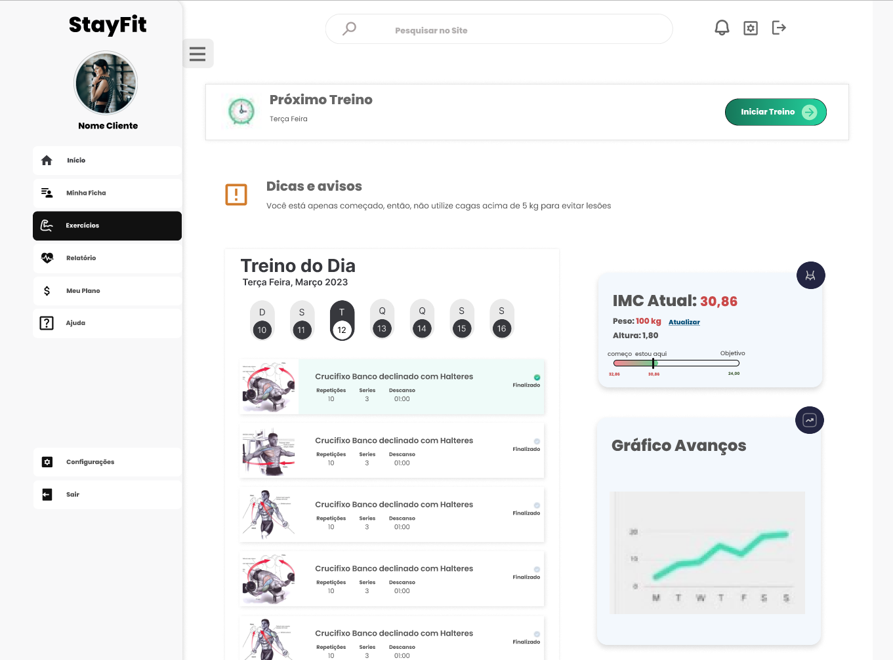
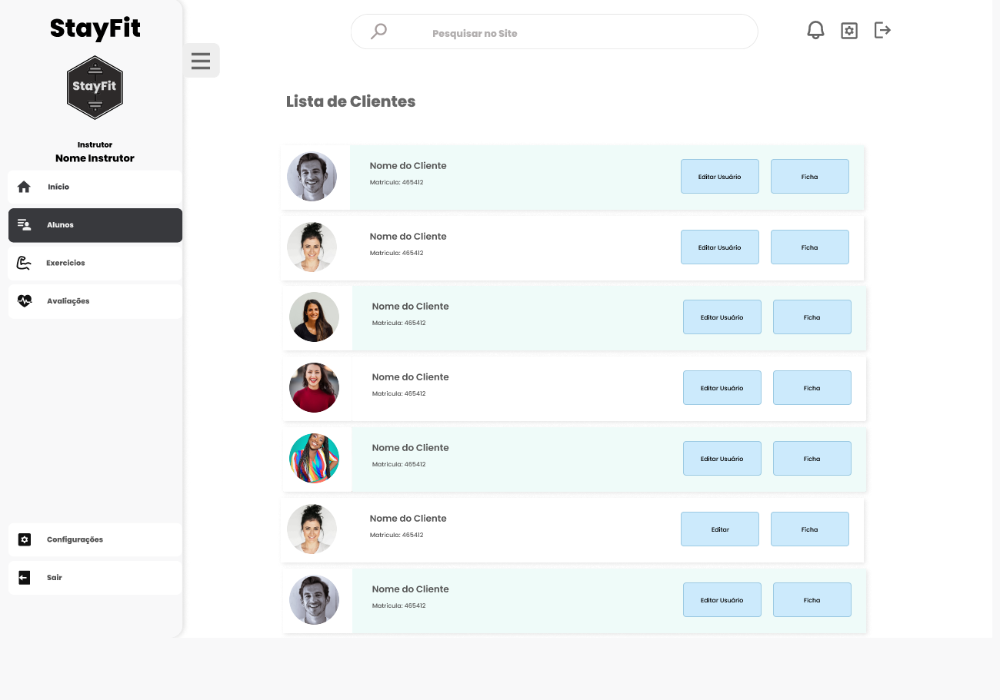
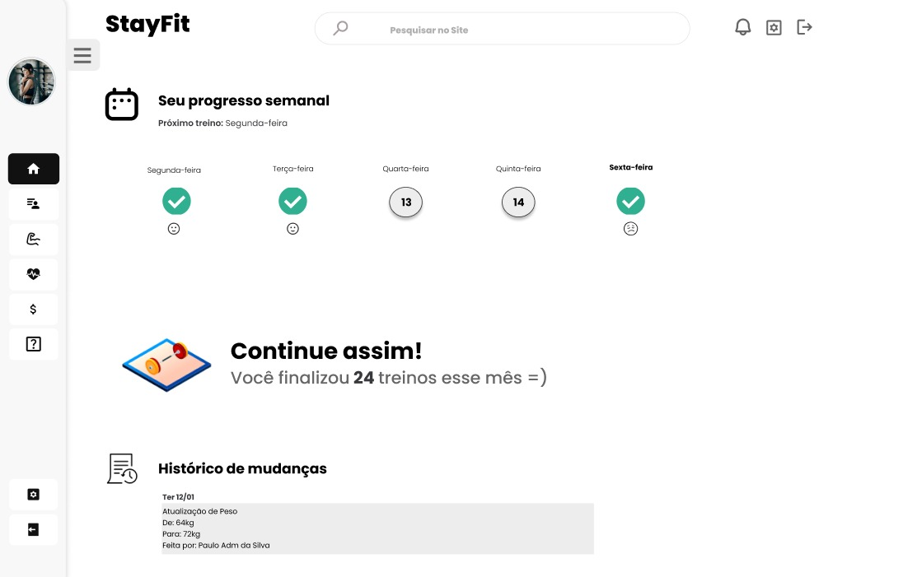
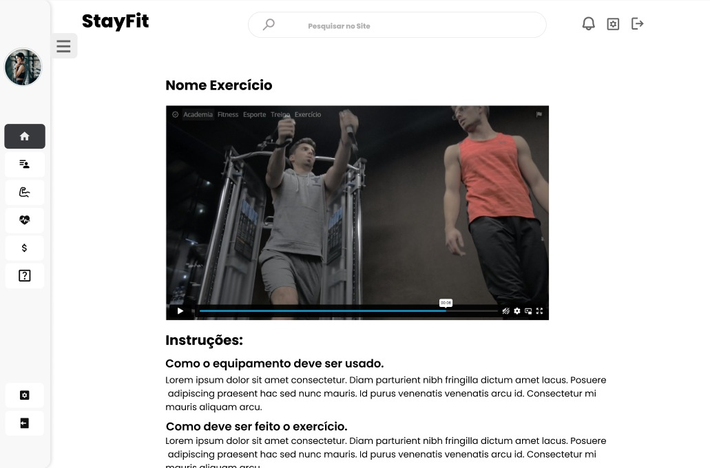
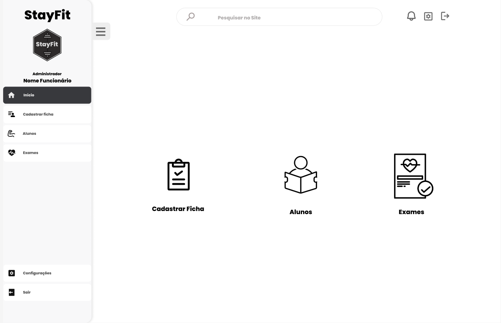
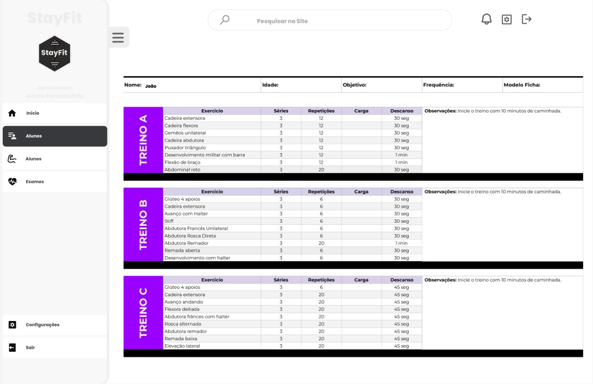
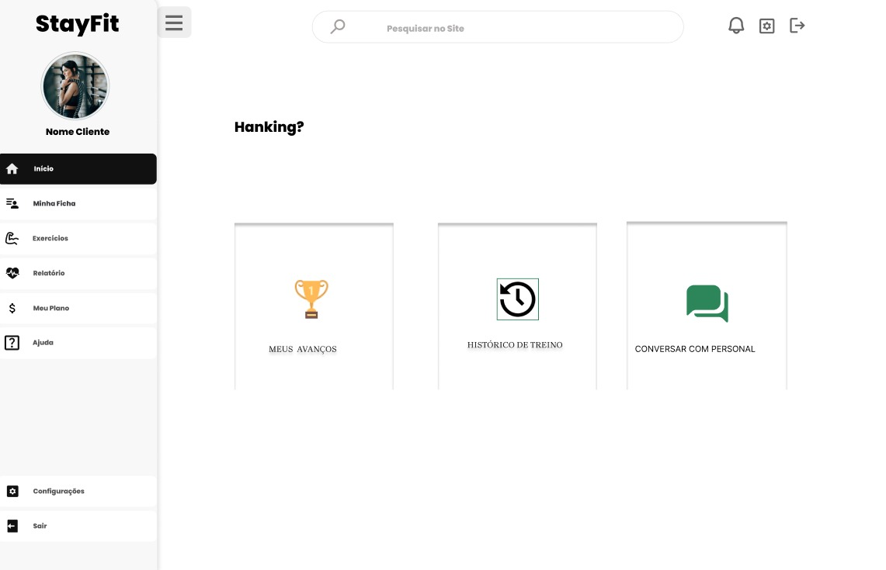

# Projeto de Interface

Pré-requisitos: <a href="2-Especificação do Projeto.md"> Documentação de Especificação</a>

Visão geral da interação do usuário pelas telas do sistema e protótipo interativo das telas com as funcionalidades que fazem parte do sistema (wireframes).

## Fluxo

 
    

### Diagrama de Fluxo

 
    

##### _Figura - Diagrama de Fluxo_

## Wireframes
### 
Página: Wirefame Padrão

 
    

##### _Figura - WireFrame Padrão_
### 
Página: Criar/Editar Ficha do Cliente

 
    

##### _Figura - Criar/Editar Ficha do Cliente_

### 
Página: Exercicios do Aluno

 
    

##### _Figura - Exercicios_

### 
Página: Instrutor lista seus clientes

 
    

##### _Figura - Listar Clientes_

### 
Página: Histórico do aluno

 
    

##### _Figura - Histórico do Aluno_

### 
Página: Exercício clientes

 
    

##### _Figura - Exercício_

### 
Página: Tela Principal Administrador

 
    

##### _Figura - Tela Principal Administrador_

### 
Página: Tela Adm Cadastrar Ficha

 
    

##### _Figura - Tela Adm Cadastrar Ficha_

=======

 
    

### 
Página: Home

 
    

##### _Figura - Home_
=======
