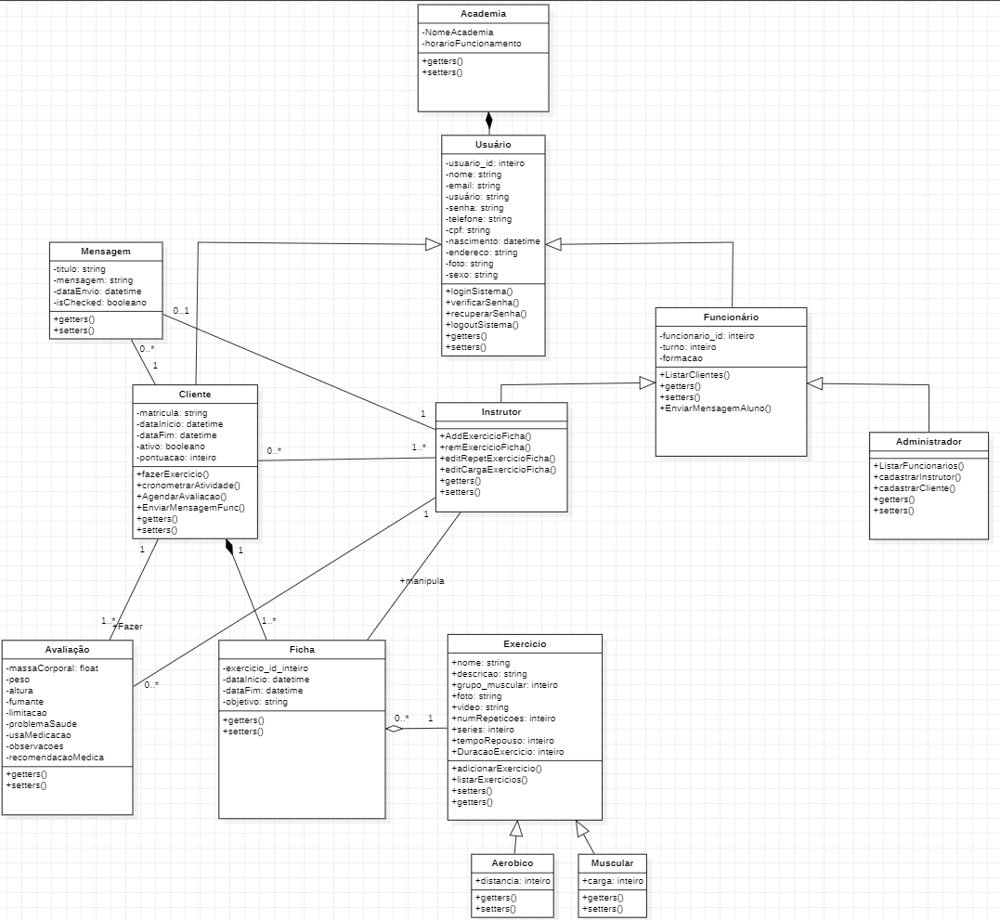
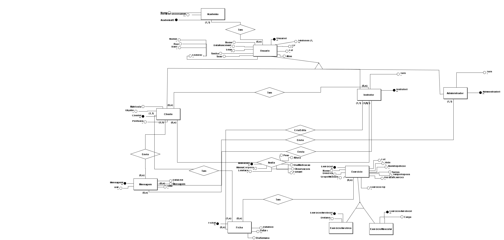
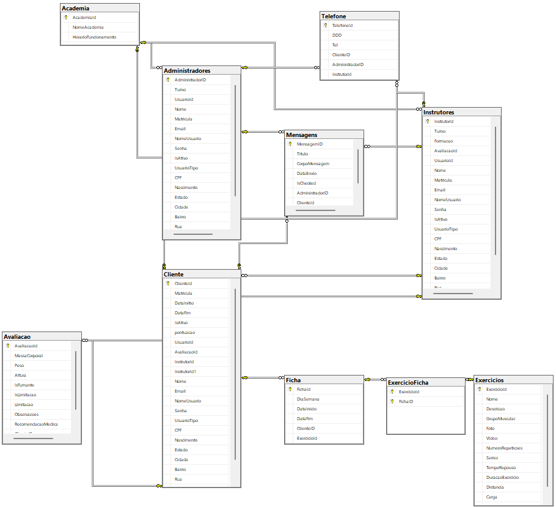

# Arquitetura da Solução

Pré-requisitos: <a href="3-Projeto de Interface.md"> Projeto de Interface</a>

Definição de como o software é estruturado em termos dos componentes que fazem parte da solução e do ambiente de hospedagem da aplicação.

## Diagrama de Classes

O diagrama de classes ilustra graficamente como será a estrutura do software, e como cada uma das classes da sua estrutura estarão interligadas. Essas classes servem de modelo para materializar os objetos que executarão na memória.

 
  

 
##### _Figura 1 - Diagrama de Classes_

## Modelo ER (Projeto Conceitual)

O Modelo ER representa através de um diagrama como as entidades (coisas, objetos) se relacionam entre si na aplicação interativa.

 
  

 
##### _Figura 2 - Diagrama Entidade Relacionamento_

 
  

 
##### _Figura 3 - Diagrama Entidade Relacionamento_

## Projeto da Base de Dados

O projeto da base de dados corresponde à representação das entidades e relacionamentos identificadas no Modelo ER, no formato de tabelas, com colunas e chaves primárias/estrangeiras necessárias para representar corretamente as restrições de integridade.
 

 
  

 
##### _Figura 3. Entidades(Tabelas) indentificadas no Modelo ER_

## Tecnologias Utilizadas

<ul>
  <li>HTML
  <li>CSS</li>
  <li>JAVASCRIPT</li>
  <li>C#</li>
  <li>Framework DOTNET Core web MVC</li>
  <li>Entity Framework</li>
  <li>Editor de código-fonte: Visual Studio Code</li>
  <li>Visual Studio 2022 Community Edition</li>
  <li>SQL Server Management Studio (SSMS)</li>
  <li>SQL Server</li> 
</ul>

## Hospedagem

A hospedagem da aplicação é mantida no Azure.

