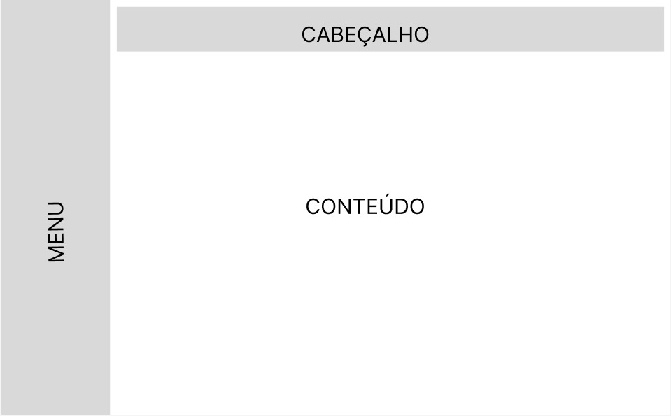

# Template Padrão da Aplicação

Pré-requisitos: <a href="2-Especificação do Projeto.md"> Especificação do Projeto</a>, <a href="3-Projeto de Interface.md"> Projeto de Interface</a>, <a href="4-Metodologia.md"> Metodologia</a>

 
  

O template padrão do site é composto pelos seguintes layouts:
<ul>
<li>Cabeçalho</li>
<li>Menu</li>
<li>Conteúdo</li>
</ul>

