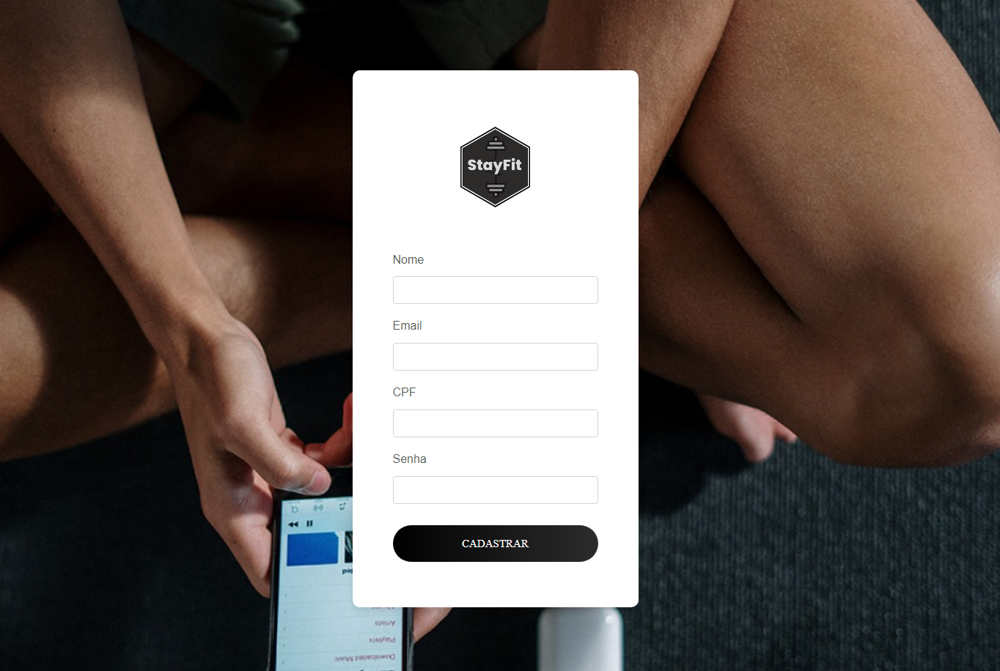
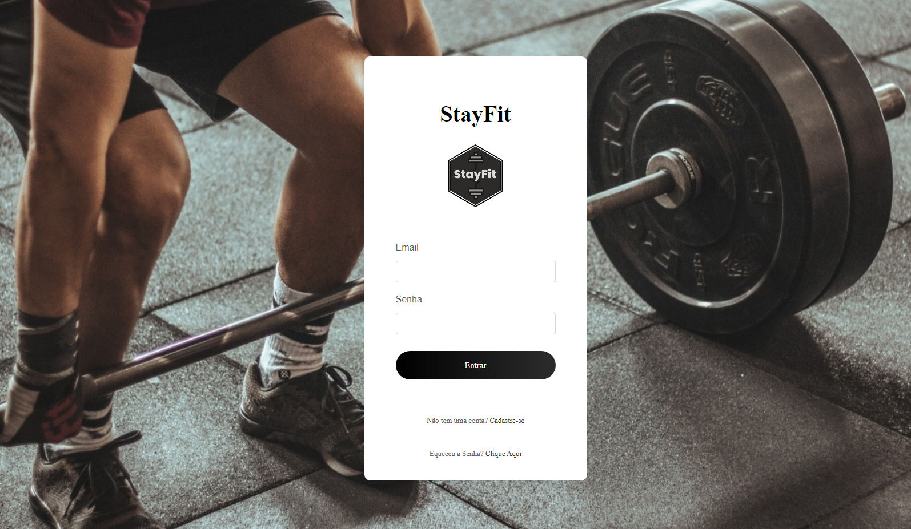
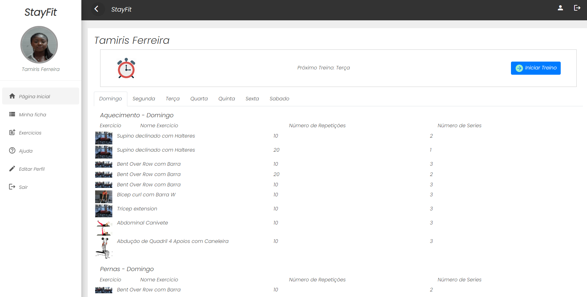
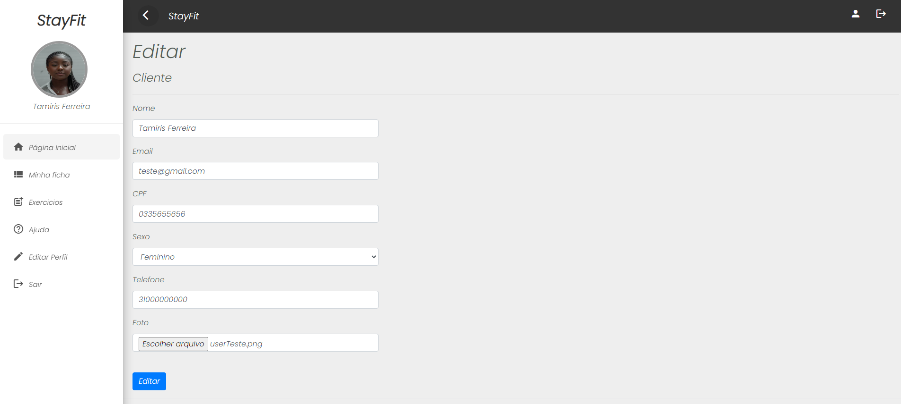
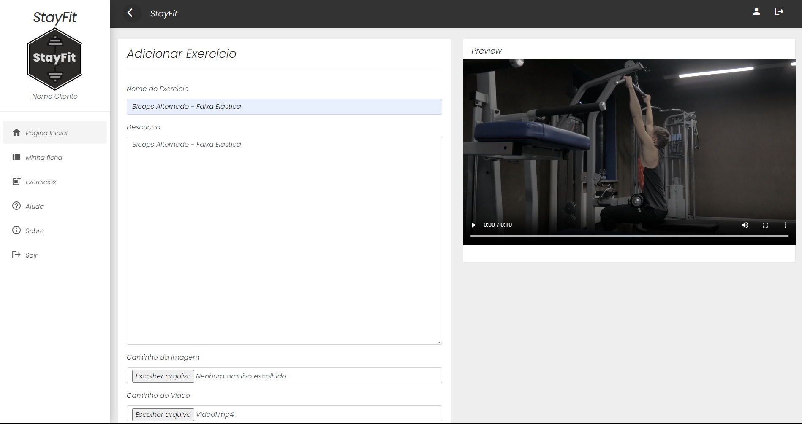
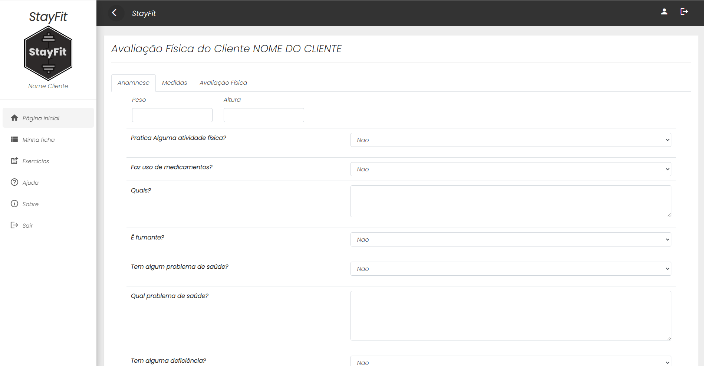
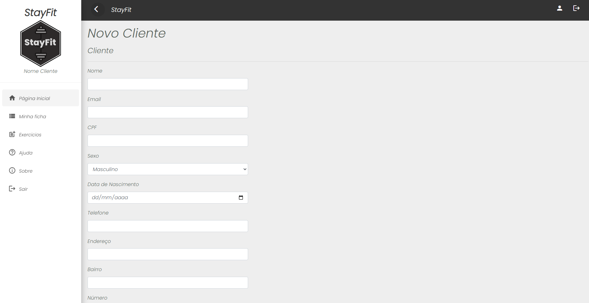

# Programação de Funcionalidades

Pré-requisitos: <a href="2-Especificação do Projeto.md"> Especificação do Projeto</a>, <a href="3-Projeto de Interface.md"> Projeto de Interface</a>, <a href="4-Metodologia.md"> Metodologia</a>, <a href="3-Projeto de Interface.md"> Projeto de Interface</a>, <a href="5-Arquitetura da Solução.md"> Arquitetura da Solução</a>

## Cadastro de usuário

    O usuário poderá realizar o cadastro no sistema preenchendo o formulario de cadastro disponivel em:
    https://appstayfit.azurewebsites.net/cadastro

  

  ##### _Figura 1 - Cadastro no Sistema_ 
  
## Login de usuário

    O usuário poderá realizar o Login no sistema preenchendo o formulario de cadastro disponivel em:
    https://appstayfit.azurewebsites.net/cadastro

  

  ##### _Figura 2 - Login no Sistema_ 

## Login de usuário

    O usuário poderá realizar o Login no sistema, preenchendo o formulario de cadastro disponivel em:
    https://appstayfit.azurewebsites.net/Login

  

  ##### _Figura 2 - Login no Sistema_ 

## Ficha de Cliente

    Ficha do Cliente, onde poderá visualizar as atividades criadas pelo personal, e registrar suas atividades físicas.
      É necessario estar logado no sistema...
     Usuário de teste: teste@gmail.com , senha: 123123
    https://appstayfit.azurewebsites.net/cliente/ficha

  

  ##### _Figura 3 - Ficha do Cliente_ 

  ## Resultados de Testes Físicos

    Página onde o Cliente poderá visualizar avaliações físicas feitas pelo personal.
      É necessario estar logado no sistema...
     Usuário de teste: teste@gmail.com , senha: 123123
    https://appstayfit.azurewebsites.net/cliente/avaliacao

  

  ##### _Figura 4 - Resultado de Avaliação Física_ 

## Editar Usuário

    Página onde o Cliente poderá editar seus dados pessoais.
      É necessario estar logado no sistema...
     Usuário de teste: teste2@gmail.com , senha: 123123
    https://appstayfit.azurewebsites.net/Cliente/Edit

  

  ##### _Figura 5 - Editar Usuário_ 

  ## Adicionar Exercício

    O instrutor poderá registrar exercícios físicos na base de dados do sistema.
      É necessario estar logado no sistema...
     Usuário de teste: teste2@gmail.com , senha: 123123
    https://appstayfit.azurewebsites.net/exercicio/create

  

  ##### _Figura 6 - Adicionar Exercício_ 

 ## Avaliação Física do Cliente

    O instrutor poderá registrar a avaliação física do cliente, permitindo o ao cliente visualizar sua evolução física.
      É necessario estar logado no sistema...
     Usuário de teste: teste2@gmail.com , senha: 123123
    https://appstayfit.azurewebsites.net/Instrutor/Avaliar?cliente=1

  

  ##### _Figura 7 - Avaliação Física do Cliente_ 

 ## Criar Ficha do Cliente

    O instrutor poderá criar uma ficha personalizada para o cliente.
      É necessario estar logado no sistema...
     Usuário de teste: teste2@gmail.com , senha: 123123
     https://appstayfit.azurewebsites.net/Ficha/Create?cliente=1

  

##### _Figura 8 - Avaliação Física do Cliente_ 

 ## Cadastrar Cliente

    Clientes devem ser registrados na academia pelo administrador, ou atendente.
      É necessario estar logado no sistema...
     Usuário de teste: teste2@gmail.com , senha: 123123
     https://appstayfit.azurewebsites.net/Admin/Cliente/CreateClient

  

  ##### _Figura 9 - Cadastrar Cliente_

 ## Listar Clientes

    O instrutor poderá listar seus clientes.
      É necessario estar logado no sistema...
     Usuário de teste: teste2@gmail.com , senha: 123123
     https://appstayfit.azurewebsites.net/Admin/Cliente

  

  ##### _Figura 10 - Cadastrar Cliente_