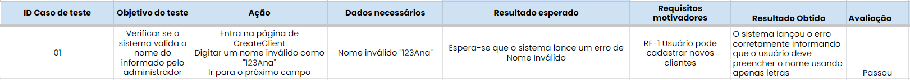
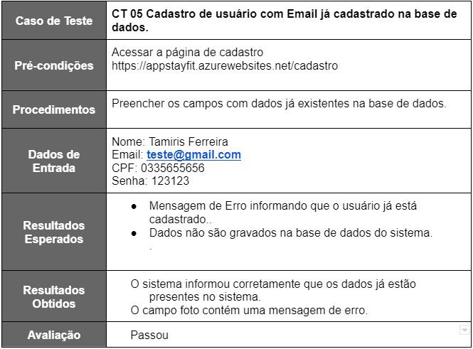
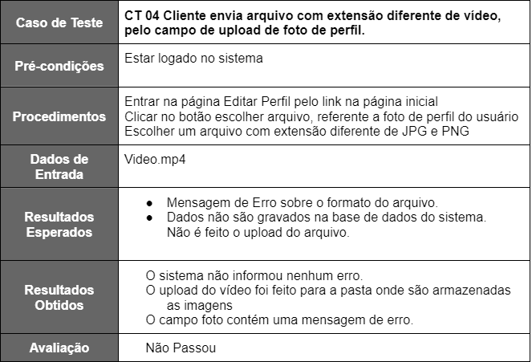

# Registro de Testes de Software

  

  ##### _Figura 1- Registro de testes de software para Validar Nome_

  

  ##### _Figura 2- Registro de testes de software para campos vazios_

 

  ##### _Figura 3- Registro de testes de software para E-mail valido_

  ##### _Figura 4 - Registro de testes de software para dados já cadastrados_ 

  

  ##### _Figura 5 - Registro de testes de software para upload de arquivo invalido_ 