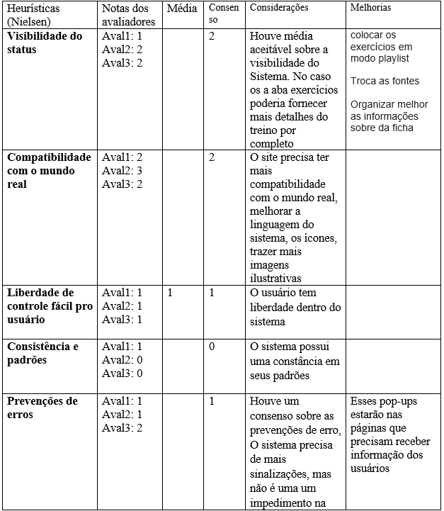
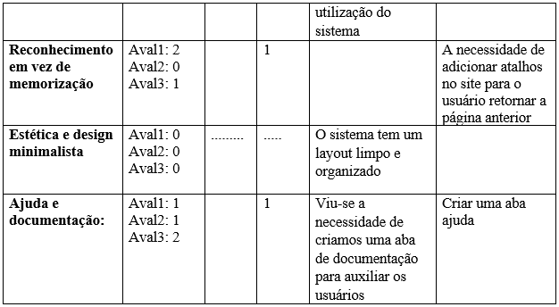
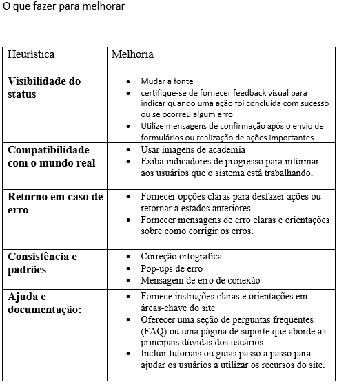
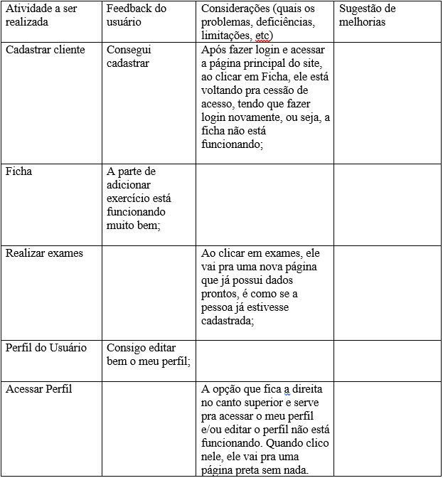

# Registro de Testes de Usabilidade

  

  ##### _Figura 1- Escalas utilizadas na Avaliação Estática_
  

**Objetivos dos testes:**

Verificar a facilidade de uso do software StayFit  
Identificar problemas de usabilidade e propor soluções  
Verificar se o software atende às necessidades dos usuários  
Melhorar a experiência do usuário com o software

**Estratégia de teste:**

Teste de usabilidade com usuários: realizar testes com usuários reais para avaliar a usabilidade do software StayFit  
Observação direta: observar o comportamento do usuário durante os testes para identificar problemas de usabilidade  
Entrevistas com usuários: realizar entrevistas após os testes para coletar feedback adicional sobre a usabilidade do software

**Plano de teste:**

Selecionar um grupo de usuários representativos do público-alvo do software StayFit  
Preparar uma lista de tarefas específicas que os usuários devem realizar no software  
Pedir aos usuários que realizem as tarefas enquanto são observados  
Coletar feedback dos usuários após os testes por meio de entrevistas ou questionários

**Avaliação Estática**

  
  

**O que melhorar**
 

**Avaliação Funcional**

 
 
 

