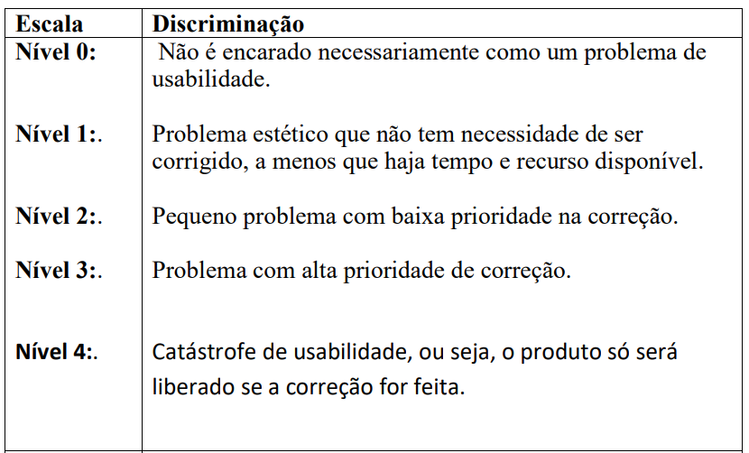

# Registro de Testes de Usabilidade

  

  ##### _Figura 1- Escalas utilizadas na Avaliação Estática_
  

**Objetivos dos testes:**

Verificar a facilidade de uso do software StayFit  
Identificar problemas de usabilidade e propor soluções  
Verificar se o software atende às necessidades dos usuários  
Melhorar a experiência do usuário com o software

**Estratégia de teste:**

Teste de usabilidade com usuários: realizar testes com usuários reais para avaliar a usabilidade do software StayFit  
Observação direta: observar o comportamento do usuário durante os testes para identificar problemas de usabilidade  
Entrevistas com usuários: realizar entrevistas após os testes para coletar feedback adicional sobre a usabilidade do software

**Plano de teste:**

Selecionar um grupo de usuários representativos do público-alvo do software StayFit  
Preparar uma lista de tarefas específicas que os usuários devem realizar no software  
Pedir aos usuários que realizem as tarefas enquanto são observados  
Coletar feedback dos usuários após os testes por meio de entrevistas ou questionários

**Avaliação Estática**
| Heurísticas |	Notas dos avaliadores |	Média	| Consenso |	Considerações |	Melhorias |
|---------------|------------------------------------|------------------------------------|------------------------------------|------------------------------------|------------------------------------|
| Visibilidade do status do sistema | Avaliador1: 1 Avaliador2: 1 Avaliador3: 1 | 1 | 1 | O sistema contem feedbacks em em ações de escrita no banco de dados. | Nenhuma
| Correspondência entre sistema e mundo real | Avaliador1: 1 Avaliador2: 1 Avaliador3: 1 | 1 | 1 | Nenhuma | Nenhuma
| Controle de usuário e liberdade | Avaliador1: 2 Avaliador2: 2 Avaliador3: 2 | 2 | 2 | Nenhuma | Nenhuma 
| Consistência e padrões | Avaliador1: 2 Avaliador2: 2 Avaliador3: 2 | 2 | 2 | Nenhuma | Nenhuma 
| Prevenção de erros | Avaliador1: 1 Avaliador2: 1 Avaliador3: 1 | 1 | 1 | Em campos de formulário, o sistema informa o erro ao usuário, caso o dado seja invalido | Nenhuma
| Reconhecimento ao invés de recordação | Avaliador1: 2 Avaliador2: 1 Avaliador3: 1 | 1 | 1 | Nenhuma | Nenhuma
| Flexibilidade e eficiência de uso | Avaliador1: 1 Avaliador2: 1 Avaliador3: 1 | 1 | 1 | Nenhuma | Nenhuma
| Estética e design minimalista | Avaliador1: 3 Avaliador2: 3 Avaliador3: 3 | 3 | 3 | Nenhuma | Nenhuma
| Ajudar os usuários e reconhecer, diagnosticar se recuperar de erros | Avaliador1: 2 Avaliador2: 2 Avaliador3: 2 | 2 | 2 | Sistema em desenvolvimento, ainda não exibe como tratar um possível erro | Nenhuma
| Ajuda e documentação | Avaliador1: 1 Avaliador2: 1 Avaliador3: 1 | 1 | 1 | Nenhuma | Nenhuma

**O que melhorar**
| Heurísticas |	Melhoria |
|---------------|------------------------------------|
| Visibilidade do status do sistema | Adicionar status de envio para campos de upload.
| Correspondência entre sistema e mundo real | Nenhuma
| Controle de usuário e liberdade | Nenhuma
| Consistência e padrões | Nenhuma
| Prevenção de erros | Pedir confirmação antes de uma ação. 
| Reconhecimento ao invés de recordação | Usar imagens em conjunto com textos. 
| Flexibilidade e eficiência de uso | Nenhuma
| Estética e design minimalista | Nenhuma 
| Ajudar os usuários e reconhecer, diagnosticar se recuperar de erros | Seria interessante o sistema exibir a mensagem de erro indicando onde ocorreu o erro e como trata-lo
| Ajuda e documentação | Adicionar mensagens com instruções. Adicionar página com instruções.

**Avaliação Funcional**

| Atividade a ser realizada | Feedback do usuário | Considerações (quais os problemas, deficiências, limitações, etc) | Sugestão de melhorias |
|--------------------|------------------------------------|------------------------------------|------------------------------------|
| Cadastro de Clientes - Campos obrigatórios: Nome, CPF, Telefone, Endereço | Foi fácil cadastrar um cliente | O sistema permite o cadastro de CPF invalido. | Nenhuma | 
| Cadastro de Exercícios - Campos obrigatórios:Nome do Exercício, Descrição | Incluir campos para upload | Nenhum | Campos para upload de arquivos | 
| Criar Categoria para Ficha - Campos obrigatórios: Nome da Atividade | Consegui cadastrar as categorias desejadas | Nenhuma | Nenhuma | 
| Adicionar Treino(Conjunto de exercícios) à ficha  | Consegui realizar o lançamento | Validação de campos, o sistema permite o envio de campos requeridos | Validar campos. Ocultar campos que não serão preenchidos. | 

**Detalhamento Análise Heurística**
| ID | Característica | Sim - Não - N/A | Comentários |
|:---------------|:------------------------------------|------------------------------------|:------------------------------------|
| 1 - Visibilidade do status do sistema |
| 1.1 | As telas do sistema iniciam com um título que descreve seu conteúdo? | [x] [ ] [ ] |  |
| 1.2 | Há feedback visual do menu ou escolhas selecionadas? | [x] [ ] [ ] |  |
| 1.3 | O sistema provê visibilidade do estado atual e alternativas para ação? | [x] [ ] [ ] |  |
| 2 - Correspondência entre sistema e mundo real |
| 2.1 | Os ícones e ilustrações são concretos e familiares? | [x] [ ] [ ] |  |
| 2.2 | As cores, quando utilizadas, correspondem aos códigos de cores comuns? | [x] [ ] [ ] |  |
| 2.3 | A linguagem utilizada evita jargões técnicos? | [x] [ ] [ ] |  |
| 2.4 | Os números são devidamente separados nos milhares e nos decimais? | [ ] [x] [ ] |  |
| 3 - Controle de usuário e liberdade |
| 3.1 | Se o sistema utiliza janelas que se sobrepõem, ele permite a organização e troca simples? | [ ] [x] [ ] |  |
| 3.2 | Quando o usuário conclui uma tarefa, o sistema aguarda uma ação antes de processar? | [ ] [x] [ ] |  |
| 3.3 | O usuário é solicitado a confirmar tarefas que possuem consequências drásticas? | [ ] [x] [ ] |  |
| 3.4 | Existe uma funcionalidade para desfazer ações realizadas pelo usuário? | [ ] [x] [ ] |  |
| 3.5 | O usuário pode editar, copiar e colar durante a entrada de dados? | [x] [ ] [ ] |  |
| 3.6 | O usuário pode se mover entre campos e janelas livremente? | [x] [ ] [ ] |  |
| 3.7 | O usuário pode configurar o sistema, a sessão, a tela conforme sua preferência? | [x] [ ] [ ] |  |
| 4 - Consistência e padrões |
| 4.1 | O sistema evita uso constante de letras maiúsculas? | [ ] [x] [ ] |  |
| 4.2 | Os números são justificados à direita e alinhados quanto aos decimais? | [ ] [x] [ ] |  |
| 4.3 | Os ícones e ilustrções são rotulados? | [x] [ ] [ ] |  |
| 4.4 | As instruções aparecem de forma consistente sempre no mesmo local? | [ ] [x] [ ] |  |
| 4.5 | Os objetos do sistema são nomeados de maneira consistente em todo o sistema? | [x] [ ] [ ] |  |
| 4.6 | Os campos obrigatórios e opcionais são corretamente sinalizados? | [x] [ ] [ ] |  |
| 5 - Prevenção de erros |
| 5.1 | As opções de menu são lógicas, distintas e mutualmente exclusivas? | [ ] [ ] [x] |  |
| 5.2 | Se o sistema exibe múltiplas janelas, a navegação entre janelas é simples e visível? | [ ] [ ] [x] |  |
| 5.3 | O sistema alerta o usuário se ele está prestes a fazer erros críticos? | [ ] [x] [ ] |  |
| 6 - Reconhecimento ao invés de recordação |
| 6.1 | Há distinção clara quando é possível selecionar um item ou vários? | [ ] [ ] [x] |  |
| 6.2 | Os rótulos de campo estão próximos dos campos e separados pelo menos um espaço? | [x] [ ] [ ] |  |
| 6.3 | São utilizadas bordas para identificar possiveis grupos de elementos? | [x] [ ] [ ] |  |
| 6.4 | Existem opções default para o que o usuário precisa selecionar? | [ ] [x] [ ] |  |
| 6.5 | Há alguma diferença visível para identificar a janela ativa? | [x] [ ] [ ] |  |
| 7 - Flexibilidade e eficiência de uso |
| 7.1 | Existem atalhos para as funções disponíveis no sistema? | [x] [ ] [ ] |  |
| 7.2 | O usuário pode realizar a tarefa de maneiras mais simplificadas? | [ ] [ ] [x] |  |
| 7.3 | O sistema permite integração com outras fontes das informações tratadas? | [ ] [x] [ ] |  |
| 8 - Estética e design minimalista |
| 8.1 | Apenas a informação necessária para ação está visível na tela? | [x] [ ] [ ] |  |
| 8.2 | Os ícones e ilustrações estão distintos do seu fundo? | [x] [ ] [ ] |  |
| 8.3 | Os agrupamentos são separados por espaço em branco? | [x] [ ] [ ] |  |
| 8.4 | Os rótulos e menus são breves, familiares e descritivos das opções que representam? | [ ] [ ] [x] |  |
| 9 - Ajudar os usuários e reconhecer, diagnosticar se recuperar de erros |
| 9.1 | É utilizado um sinal sonoro para alertar de erros? | [ ] [ ] [x] |  |
| 9.2 | Os questionamentos são breves e sem ambiguidade? | [ ] [ ] [x] |  |
| 9.3 | Se um erro é detectado, o usuário tem visibilidade sobre qual o local gerador do erro? | [x] [ ] [ ] |  |
| 9.4 | As mensagens de erro identificam a severidade e a causa do erro? | [x] [ ] [ ] |  |
| 9.5 | As mensagens de erro sugerem uma ação para correção? | [x] [ ] [ ] |  |
| 10 - Ajuda e documentação |
| 10.1 | As instruções online estão visualmente distintas? | [ ] [x] [ ] |  |
| 10.2 | Existe ajuda online sensível ao contexto? | [ ] [ ] [ ] |  |
| 10.3 | É simples o acesso a ajuda do sistema e retorno ao sistema? | [ ] [ ] [ ] |  |

